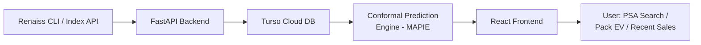

# 🧠 Renaiss Intelligence

### *Calibrated Price Confidence for Collectors*

> **Renaiss Tech Hackathon — Season 1 | AI Category**

[](https://renaissos.com)
[](#tech-stack)
[](#hackathon-category)

live website: https://renaiss-intelligence-frontend.vercel.app/
---

## 📖 Overview

**Renaiss Intelligence** is an AI-powered market intelligence tool for Renaiss collectibles that goes beyond simple price tracking. Instead of a single "Fair Market Value" number, it delivers **statistically calibrated confidence intervals** for PSA-graded card values using Adaptive Conformal Inference — giving collectors a real sense of price uncertainty and reliability.

On top of that, it provides **real-time pack Expected Value (EV) analysis** for RenaCrypt, and Eden gacha packs, pulling from actual recent pull data via the Renaiss CLI — so buyers can make data-driven decisions about whether a pack is worth its price.

---

## ❗ Problem Statement

Collectors today face two core information gaps:

1. **No uncertainty on pricing.** Platforms show a single Fair Market Value (FMV) figure with no indication of how reliable or volatile that number is. A card that sold for $100 once and $400 last week has a very different confidence profile than one that sells consistently at $200 — but current tools treat them identically.

2. **No EV data for packs.** Pack buyers have no data-driven way to assess whether a pack's retail price is justified relative to its actual payout distribution. Buying a $150 Eden Pack without knowing the EV is a gamble with no baseline.

Renaiss Intelligence solves both problems with statistical rigour and transparent data sourcing.

---

## ✨ What It Does

### 🔍 PSA Cert Lookup with Confidence Intervals
- Enter any PSA cert number to retrieve the card's current market price estimate.
- Prices are returned as **80% confidence interval ranges** (e.g. `$120 – $340`) rather than a single point estimate.
- Uses **Adaptive Conformal Inference** (via MAPIE) when sufficient historical sales data exists.
- Automatically falls back to **bootstrap heuristic estimation** when sample size is low — clearly labeled in the UI so users always know which method was used.

### 📦 Real-Time Pack EV Calculator
Live EV analysis for all three major Renaiss pack tiers:

| Pack | Price | Method |
|------|-------|--------|
| OMEGA Pack | $48 | Conformal EV range |
| RenaCrypt Pack | $88 | Conformal EV range |
| Eden Pack | $150 | Conformal EV range |

EV is calculated from actual recent pull data retrieved via the **Renaiss CLI**, not assumptions or averages.

### 🏆 Recent Notable Pulls
- Displays the top-value pulls per pack type.
- Each pull links directly back to the Renaiss marketplace for verification.

### 📊 Live Marketplace Sales Feed
- Streams recent sales from the Renaiss Index API.
- Runs **price-gap analysis** against the conformal price range to return a verdict:
  - 🟢 **Underpriced** — below the confidence interval lower bound
  - 🟡 **Fair** — within the confidence interval
  - 🔴 **Overpriced** — above the confidence interval upper bound

### ⚠️ Beta Data Transparency Banner
- A persistent, always-visible banner communicates the beta nature of the underlying data per Renaiss's guidance.

---

## 🛠 Tech Stack

| Layer | Technology |
|---|---|
| **Backend** | FastAPI (Python), SQLAlchemy |
| **Database** | Turso (libSQL cloud database) |
| **Statistical Engine** | MAPIE (conformal prediction), scikit-learn |
| **Frontend** | React, Vite, Tailwind CSS |
| **Data Source** | Renaiss CLI (`npx renaiss`) + Renaiss Index API (`https://api.renaissos.com`) |
| **Deployment** | Vercel (frontend + serverless backend), Turso (database) |

---

## ⚠️ Data Sources & Limitations

> **This project uses the Renaiss CLI and Renaiss Index API, both currently in beta. Per Renaiss's guidance: some data may be incomplete, missing, delayed, or still being updated. All pricing and EV outputs in this tool are experimental references, not final verified market facts. Where historical price data is insufficient for full conformal calibration, the tool falls back to a bootstrap heuristic range and clearly labels this in the UI.**

---

## 🏗 Architecture



**Node breakdown:**
- **Renaiss CLI / Index API** — Primary data source; provides raw sales history, pack pull records, and marketplace listings.
- **FastAPI Backend** — Ingests, validates, and serves data; orchestrates calls to the CLI and the Index API.
- **Turso Cloud DB** — Persists historical price data in a libSQL edge database to power statistical calibration over time.
- **Conformal Prediction Engine (MAPIE)** — Consumes stored price history to compute calibrated 80% confidence intervals via Adaptive Conformal Inference.
- **React Frontend** — Renders the PSA lookup UI, pack EV dashboard, notable pulls feed, and live marketplace sales with verdict badges.
- **User** — Interacts with all three core flows: PSA cert search, pack EV analysis, and live sales monitoring.

---

## 🚀 Setup Instructions

### Prerequisites
- Python 3.10+
- Node.js 18+ with `pnpm`
- A [Turso](https://turso.tech) account (free tier works)

### 1. Clone the Repository

```bash
git clone https://github.com/samixrd/renaiss-glass-insight.git
cd renaiss-glass-insight
```

### 2. Install Python Dependencies

```bash
pip install -r requirements.txt
```

### 3. Install Frontend Dependencies

```bash
pnpm install
```

### 4. Configure Environment Variables

Create a `.env` file in the project root:

```env
TURSO_DATABASE_URL=libsql://your-database-name.turso.io
TURSO_AUTH_TOKEN=your-turso-auth-token
```

> **Getting your Turso credentials:**
> ```bash
> turso db create renaiss-intelligence
> turso db show renaiss-intelligence --url
> turso db tokens create renaiss-intelligence
> ```

### 5. Run the Backend

```bash
uvicorn app.main:app --reload
```

The API will be available at `http://localhost:8000`. Interactive docs at `http://localhost:8000/docs`.

### 6. Run the Frontend

```bash
pnpm dev
```

The frontend will be available at `http://localhost:5173`.

---

## 🌐 Live Demo

| Service | URL |
|---------|-----|
| **Frontend** | `[https://renaiss-intelligence-frontend.vercel.app/]` |
| **Backend API** | `[https://renaiss-glass-insight-main.vercel.app/]` |

---

## 👥 Team

**[Spellman]**

---

## 🏆 Hackathon Category

Submitted under: **AI Category** — Renaiss Tech Hackathon Season 1

---

## 📄 License

This project was built for the Renaiss Tech Hackathon Season 1. All Renaiss platform data is subject to Renaiss's own terms of service. Statistical methodology (conformal prediction) is implemented using the open-source [MAPIE](https://github.com/scikit-learn-contrib/MAPIE) library.
